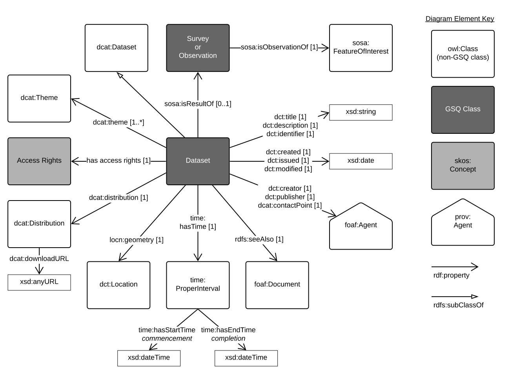
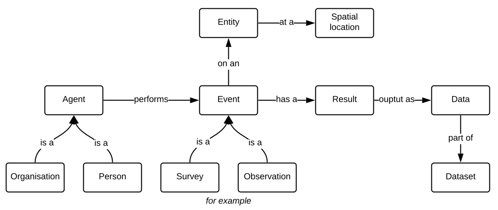

# GSQ Dataset Profile

This is a model of a general `dataset`.

  

**Fig. 1**: The general model of a dataset (after [DCAT (rev)](https://w3c.github.io/dxwg/dcat/)).  

It is a profile of the [DCAT (rev)](https://w3c.github.io/dxwg/dcat/) Dataset Catalogue Vocabulary model of dataset's metadata. It is used for describing the [Geological Survey of Queensland (GSQ)](https://www.business.qld.gov.au/industries/mining-energy-water/resources/geoscience-information/gsq)'s datasets which are listed in a dataset catalogue.

In addition to profiling DCAT (rev), this profile, through published alignments of DCAT (rev) is mapped to [ISO 19115-1:2014 Geographic information -- Metadata](https://www.iso.org/standard/53798.html) which is the model used for spatial dataset's metadata transfer in Australia.

## Usage

A `dataset` is the output of an activity on an entity by an agent.

  

**Fig. 2**: The level 0 conceptual model of creating a dataset.

### An example:

* A company performs a `survey` to collect geochemical samples, `observations` are performed on the samples, with measurements recorded as `results`. The measurements (data) are compiled into a `dataset` that meets the requirements of the end user of the data.

## Profile Resources

This profile is presented as a series of files that perform different roles:

* [Guidance document](Guidance.pdf) - a written document explaining how to use this profile
* [model](model/) - the *model* folder contains this profile's models in both graphical (SVG) and machine-readable, textual, form ( [RDF](https://www.w3.org/RDF/) turtle).
* [imports/](imports/) - other ontologies this profile imports.
* [constraints.ttl](constraints.ttl) - a constraints file, formulated using [SHACL](https://www.w3.org/TR/shacl/), that can be used to validate instances of metadata to check conformance with this profile.
* [profile.ttl](profile.ttl) - the profile declaration. A description of all of the items in this profile (the formal model, validating resources, documentation etc.) according to the W3C's [Profiles Ontology](https://www.w3.org/TR/dx-prof/) which describes how all the parts related to one another, the roles they play (to give *guidance* for use, to *validate* data etc.) and how this profile *profiles* the various standards listed above.

## GSQ classes

CLasses used in this profile:
1. [GSQ Survey Profile](https://github.com/geological-survey-of-queensland/gsq-survey-profile)

## OWL classes

1. [dcat:Dataset](https://w3c.github.io/dxwg/dcat/#Class:Dataset)
2. [dcat:Theme](https://w3c.github.io/dxwg/dcat/#Property:resource_theme) - used to categorise the resource, the GSQ themes are described as [skos:Concept](http://www.w3.org/2004/02/skos/core#Concept)s in the vocabulary [GSQ Data Themes](http://vocabs.gsq.digital/vocabulary/gsq-data-themes)
3. [dcat:Distribution](https://w3c.github.io/dxwg/dcat/#Class:Distribution)
4. [dct:Location](https://w3c.github.io/dxwg/dcat/#Class:Location)
5. [dct:creator](https://w3c.github.io/dxwg/dcat/#Property:resource_creator)
6. [dct:publisher](https://w3c.github.io/dxwg/dcat/#Property:resource_publisher)
7. [dct:contactPoint](https://w3c.github.io/dxwg/dcat/#Property:resource_contact_point)
8. [dct:title](https://w3c.github.io/dxwg/dcat/#Property:resource_title)
9. [dct:description](https://w3c.github.io/dxwg/dcat/#Property:resource_description)
10. [dct:identifier](https://w3c.github.io/dxwg/dcat/#Property:resource_identifier)
11. [dct:license](https://w3c.github.io/dxwg/dcat/#Property:resource_license) - not shown in diagram for readability
12. [dcat:keyword](https://w3c.github.io/dxwg/dcat/#Property:resource_keyword) - not shown in diagram for readability
13. [foaf:Agent](http://xmlns.com/foaf/spec/#term_Agent)
14. [SOSA sample](https://www.w3.org/TR/vocab-ssn/#SOSASample)
15. [SOSA feature of interest](https://www.w3.org/TR/vocab-ssn/#SOSAFeatureOfInterest)
16. [SOSA observation](https://www.w3.org/TR/vocab-ssn/#SOSAObservation)
17. [SOSA sampling](https://www.w3.org/TR/vocab-ssn/#SOSASampling) - the survey event
18. [rdfs:seeAlso](https://www.w3.org/TR/rdf-schema/#ch_seealso) - refers to secondary metadata
19. [FOAF document](http://xmlns.com/foaf/spec/#term_Document) - the document with secondary metadata
20. [ProperInterval](https://www.w3.org/TR/owl-time/#time:ProperInterval)

### [Distribution](https://w3c.github.io/dxwg/dcat/#Class:Distribution) properties not shown in the diagram:

1. [Title](https://w3c.github.io/dxwg/dcat/#Property:distribution_title)
2. [Description](https://w3c.github.io/dxwg/dcat/#Property:distribution_description)
3. [Download URL](https://w3c.github.io/dxwg/dcat/#Property:distribution_download_url)
4. [Byte size](https://w3c.github.io/dxwg/dcat/#Property:distribution_size)
5. [Format](https://w3c.github.io/dxwg/dcat/#Property:distribution_format)

## Vocabularies

The vocabularies used in this profile are:

1. [GSQ Data Themes](http://linked.data.gov.au/def/gsq-dataset-theme)
2. [Data Access Rights](http://linked.data.gov.au/def/data-access-rights)
3. [Earth Science Data Category](http://linked.data.gov.au/def/earth-science-data-category)

## Licence

The content of this repository is licensed for use with the [Creative Commons 4.0 License](https://creativecommons.org/licenses/by/4.0/). See the [license deed](LICENSE) for details.

## Contacts

*owner*:  
**Mark Gordon**  
*Director - Geoscience Information*  
Geological Survey of Queensland  
<mark.gordon@dnrme.qld.gov.au>  

*author*:  
**David Crosswell**  
*Enterprise Architect*  
CrossLateral
[https://crosslateral.com.au](https://crosslateral.com.au)
